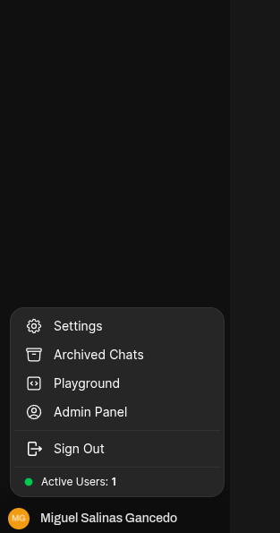
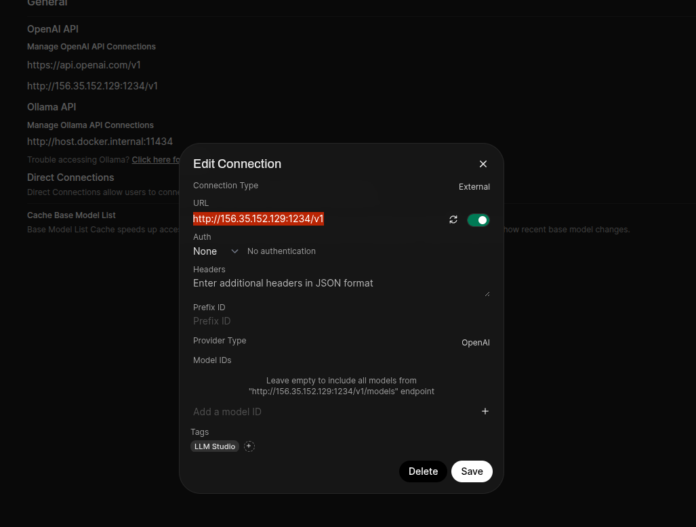
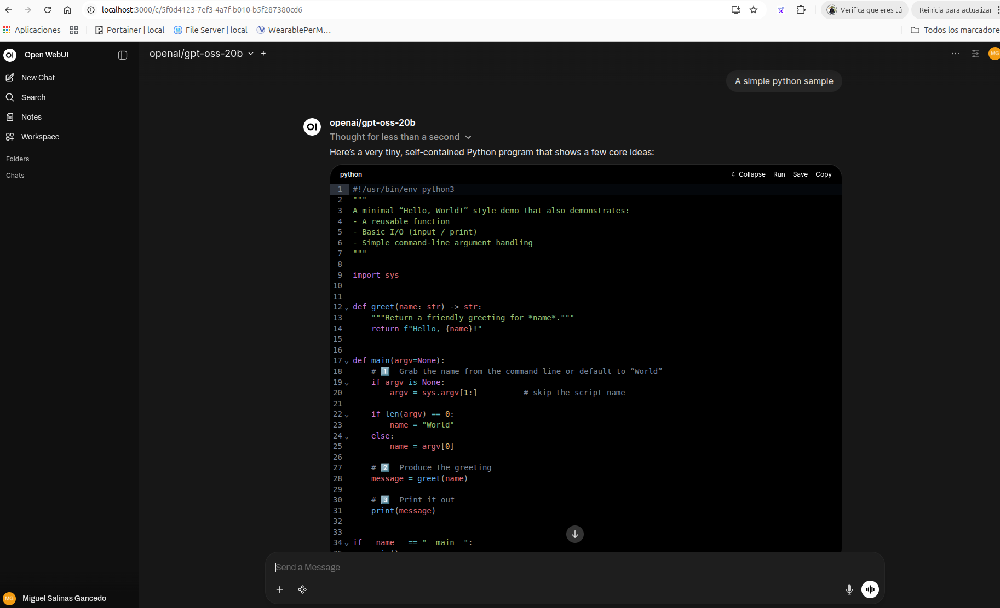

# Description
Integrate LLM models using LLM Studio with Open WebUI

## Deployment

 Follow the next steps to integrate [LLM Studio](https://lmstudio.ai/) with [Open WebUI](https://openwebui.com/)

- **STEP01**: Download LLM Studio and install
LLM Studio in Ubuntu 24.02. Download [LLM Studio for your architecture](https://lmstudio.ai/). In this case you will download a AppImage file. Copy this file under `/opt/LMStudio`, set some priviledges:

$ chown own simur:simur /opt/LMStudio
$ chmod +x /opt/LMStudio/LM_Studio.AppImage

Also download a LLM Studio icon `lmstudio.png` inside this repo under the same AppImage file folder.

- **STEP02**: Create a file launcher called `llm-studio.desktop` under `~/.local/share/applications` like this:

```
[Desktop Entry]
Name=LM Studio
Comment=LM Studio Launcher
Exec=/opt/LMStudio/LM_Studio.AppImage --no-sandbox
Icon=/opt/LMStudio/lmstudio.png
Terminal=false
Type=Application
Categories=Development;
StartupWMClass=LM Studio
```

- **STEP03**: Install a LLM Model and Load
Now we can start LLM Studio, and download our first LLM model to be used. Click in `LM Runtime` localed at left top and select a model to be downloaded and later loaded. In this case we select the model called [openai/gpt-oss-20b)](https://lmstudio.ai/models/openai/gpt-oss-20b). 


After be download we can load it. If we go to Developer menu option we see our model loaded


- **STEP04**: Start LLM Server and configure

Now with a LLM Model loaded, we can start our LLM Server. LLM Studio start a App icon menu at top of ubuntu.


Now we configure this new LLM Server from LLM Studio. Go again to Developer LLM Studio and click `Server Settings` and set this options:


With these options we can accedd to the LLM Server with port 1234 externally

- **STEP05**: Install Open WebUI
We will install Open WebUI from a docker container like this:

```
$ docker run -d -p 3000:8080 -v open-webui:/app/backend/data --name open-webui ghcr.io/open-webui/open-webui:main
```

- **STEP06**: Configure Open WebUI
Now we must create a connection with out LLM Server from Open WebUI. Open WebUI from your browser: http://localhost:3000 and register a first account in it. Later go to Settings under your account



And inside settings select Admin Settings at botton. Select the option `Connections` to create our OpenAI connection with LLM Studio Server


Click under plus icon and set this url: http://<LLM_STUDIO_SERER_HOST>:<LLM_STUDIO_SERER_PORT>/v1 without any authentication (set Auth to None)



- **STEP07**: Use your models
Now we can select any model deployed in my LLM Server and send a prompt request like this:


